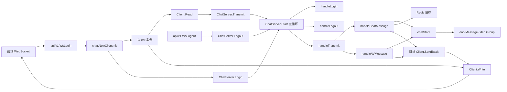
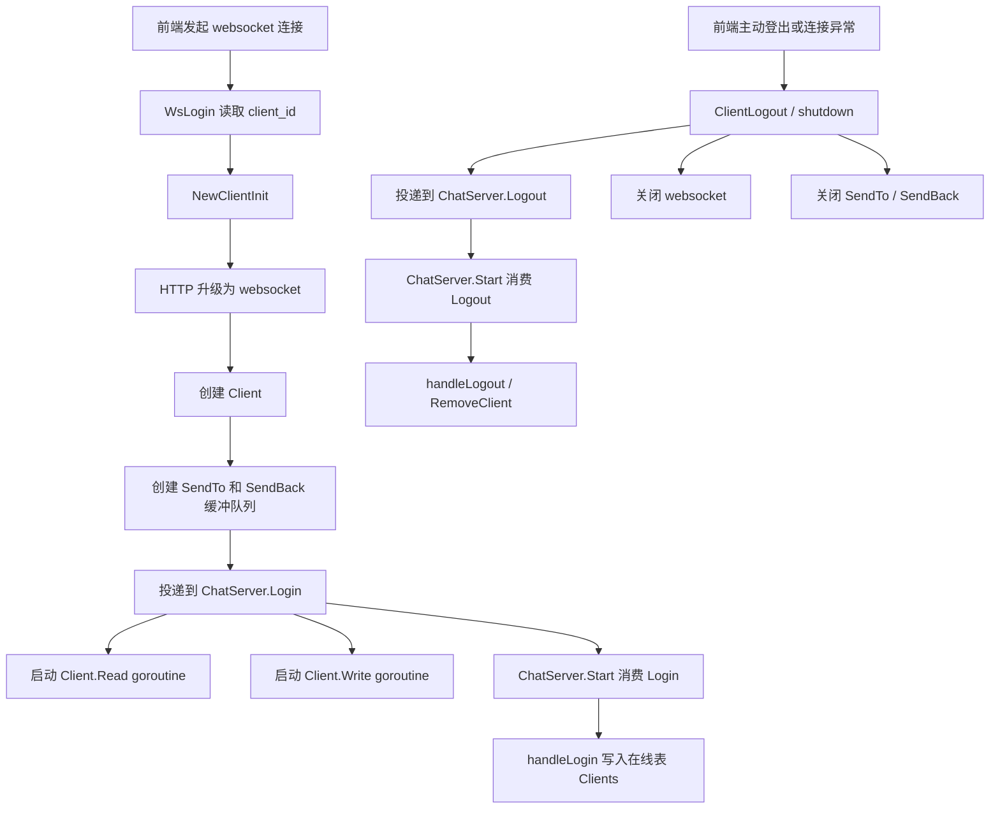
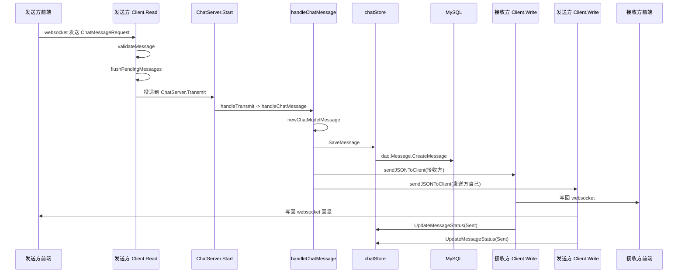
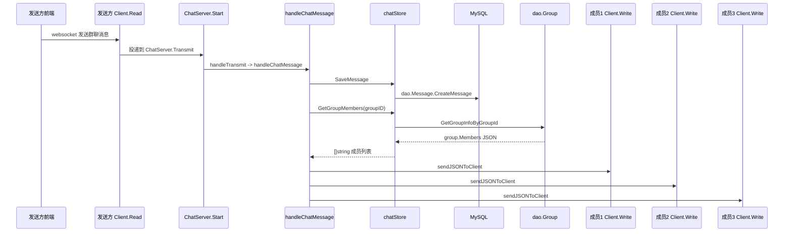
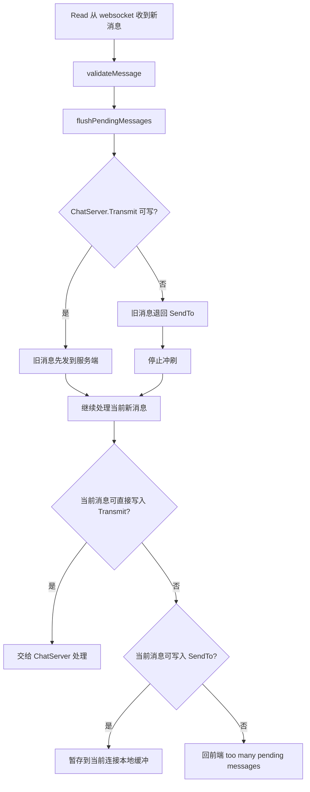
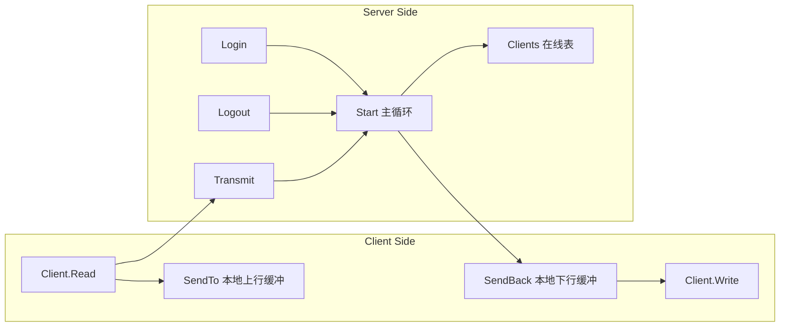

# Chat Module Flow

这份文档只聚焦 `internal/service/chat` 这一块，方便后面继续改 websocket、消息分发、群聊和音视频逻辑时快速定位。

## 1. 模块职责总览

- `client.go`：管理“一个 websocket 连接”的收和发。
- `server.go`：管理“所有在线连接”的登录、登出、消息分发、落库和缓存。
- `store.go`：给 `chat` 包提供最小存储能力，隔离底层 DAO 细节。

## 2. 整体架构图



## 3. 连接建立与销毁



## 4. 普通消息链路：单聊与群聊

### 4.1 单聊消息



### 4.2 群聊消息



## 5. 音视频信令链路

```mermaid
flowchart TD
    A[前端发送 AudioOrVideo 消息] --> B[Client.Read]
    B --> C[ChatServer.Transmit]
    C --> D[handleTransmit]
    D --> E[handleAVMessage]
    E --> F[解析 req.AVdata 为 AVData]
    F --> G{shouldPersistAVEvent?}
    G -- 是 --> H[newAVModelMessage]
    H --> I[chatStore.SaveMessage]
    G -- 否 --> J[跳过落库]
    I --> K[sendJSONToClient(仅接收方)]
    J --> K
    K --> L[接收方 Client.Write]
    L --> M[接收方前端]
```

## 6. Client 内部两级缓冲

这部分最容易读乱，单独画出来。



## 7. 在线表与消息总线



## 8. 当前实现里要特别记住的几个点

1. `Client.Read` 不做真正业务分发，它只负责把消息送进 `ChatServer.Transmit`。
2. `Client.Write` 才是真正写 websocket 的地方，所以消息状态更新也放在这里。
3. 单聊消息会回显给发送方自己，群聊消息会广播给所有在线成员。
4. `appendDirectCache` 和 `appendGroupCache` 只在缓存已存在时追加，不会在未命中时创建新缓存。
5. 音视频消息不是全部落库，只有 `shouldPersistAVEvent` 判定的关键事件才持久化。

## 9. 运行前提

当前代码结构要求 `ChatServer.Start()` 真的跑起来，`Login`、`Logout`、`Transmit` 三条通道才会被消费。

你现在的 [cmd/kama_chat_server/main.go](../cmd/kama_chat_server/main.go) 里，这段逻辑还是注释状态：

```go
// if kafkaConfig.MessageMode == "channel" {
//     go chat.ChatServer.Start()
// } else {
//     go chat.KafkaChatServer.Start()
// }
```

如果你后面要继续验证这套 channel 版 chat 流程，这里需要恢复启动。
